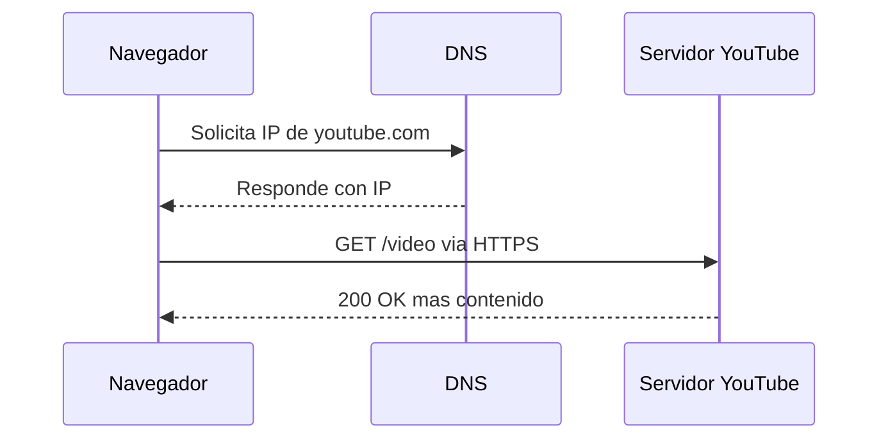

# Fundamentos de Internet #

## 1. Del Cliente al Servidor:

1. El cliente interpreta la URL:

El navegador (cliente) recibe 'www.youtube.com' y primero revisa si ya tiene esa dirección guardada en su caché local o en el archivo hosts del sistema. Si no la tiene, sabe que necesita averiguar la dirección IP asociada a ese nombre de dominio antes de poder contactar al servidor.

2. Consulta al DNS:

El navegador envía una solicitud al sistema de nombres de dominio (DNS), que funciona como una 'agenda telefónica' de internet. El DNS recorre una jerarquía de servidores (resolver local, servidores raíz, servidores TLD .com, y finalmente los servidores autoritativos de YouTube/Google) hasta traducir 'www.youtube.com' en una dirección IP numérica, por ejemplo 142.250.xxx.xxx.

3. Obtención de la dirección IP:

Con la IP en mano, el cliente ya sabe exactamente a qué máquina de la red debe dirigirse. La dirección IP identifica de forma única al servidor (o al conjunto de servidores, ya que Google usa balanceo de carga y CDNs distribuidos geográficamente) que atenderá la solicitud.

4. Se establece la conexión TCP y el cifrado TLS:

El navegador inicia una conexión TCP con esa IP mediante el 'triple apretón de manos' (SYN, SYN-ACK, ACK). Como YouTube usa HTTPS, inmediatamente después se realiza el handshake TLS/SSL: cliente y servidor intercambian certificados y claves para cifrar toda la comunicación posterior.

5. El cliente envía la solicitud HTTP/HTTPS:

Sobre esa conexión segura, el navegador envía una petición HTTP (método GET) pidiendo el recurso, por ejemplo la página principal de YouTube o el video específico. Esta petición incluye cabeceras con información como el tipo de navegador, cookies de sesión, idioma preferido, etc.

6. El servidor procesa la solicitud:

El servidor de YouTube recibe la petición, la procesa (autentica al usuario si aplica, consulta bases de datos, localiza el archivo de video en sus sistemas de almacenamiento/CDN) y prepara una respuesta HTTP con código de estado (200 OK si todo sale bien), más el contenido: HTML, CSS, JavaScript y los fragmentos del video en streaming.

7. El navegador renderiza y reproduce:

El cliente recibe la respuesta y empieza a interpretar el HTML/CSS/JS para construir la página, mientras el reproductor de video comienza a descargar y reproducir el contenido en fragmentos (streaming adaptativo), ajustando la calidad según el ancho de banda disponible, hasta que el video aparece en pantalla.



## 2. Frontend y Backend en acción

Frontend (lo que ve y usa el paciente/médico):

Es toda la interfaz con la que el usuario interactúa: el formulario para elegir fecha y hora de la cita, el calendario visual, los botones de confirmar/cancelar, las notificaciones en pantalla, etc. Se ejecuta en el navegador o app del dispositivo del usuario.

Tres tecnologías posibles:

-React (o Vue/Angular) — para construir la interfaz de usuario de forma dinámica y por componentes.
-HTML/CSS — estructura y estilo visual de las páginas (calendario, formularios).
-JavaScript/TypeScript — lógica en el cliente: validar que la fecha elegida sea válida, mostrar mensajes de error, actualizar la pantalla sin recargar.

Backend (lo que ocurre "detrás de cámaras"):

Es la lógica del servidor: verificar disponibilidad del médico, guardar la cita en la base de datos, evitar que dos pacientes reserven el mismo horario, enviar confirmaciones por correo, manejar la autenticación de usuarios, etc.

Tres tecnologías posibles:

-Node.js (Express) o Python (Django/FastAPI) — para crear la lógica del servidor y las rutas de la API.
-PostgreSQL o MySQL — base de datos para almacenar pacientes, médicos, horarios y citas.
-Java (Spring Boot) — alternativa robusta para sistemas más grandes, típico en entornos de salud con requisitos estrictos.

Cómo se comunican frontend y backend:
El frontend nunca accede directamente a la base de datos; en su lugar, hace una petición (request) HTTP a una API (Interfaz de Programación de Aplicaciones) que expone el backend. Por ejemplo, cuando el paciente hace clic en "Agendar cita", el frontend envía algo como:
POST /api/citas con los datos (paciente, médico, fecha, hora) en el cuerpo de la petición.
Esta petición viaja por el protocolo HTTP/HTTPS, especificando el método (GET para consultar horarios disponibles, POST para crear una cita, PUT/PATCH para modificarla, DELETE para cancelarla).
El backend recibe la request, ejecuta la lógica necesaria (revisa disponibilidad, guarda en la base de datos) y devuelve una respuesta (response): normalmente en formato JSON, con un código de estado como 201 Created (cita creada con éxito) o 409 Conflict (el horario ya está ocupado).
El frontend recibe esa respuesta y actualiza la pantalla en consecuencia: muestra un mensaje de "¡Cita confirmada!" o un error si algo falló.

En esencia, la API es el "contrato" que define qué peticiones puede hacer el frontend y qué respuestas dará el backend, y el ciclo request → proceso en servidor → response se repite cada vez que el usuario interactúa con la app.

## 3. REST vs SOAP vs GraphQL

| Tipo de API | Formato de datos usado | Nivel de flexibilidad | Dificultad de implementación | Uso actual (Alta / Media / Baja) |
|-------------|------------------------|------------------------|-------------------------------|-----------------------------------|
| REST        | JSON (comúnmente), también XML | Media — el servidor define qué devuelve cada endpoint | Baja | Alta |
| SOAP        | XML (estricto, con esquema WSDL) | Baja — protocolo rígido y estandarizado | Alta | Baja |
| GraphQL     | JSON | Alta — el cliente decide qué datos pedir | Media | Media |

**¿Cuál es más apropiada para una startup moderna? ¿Por qué?**

GraphQL suele ser la opción más conveniente para un sistema de reservas en línea, ya que permite al frontend pedir exactamente los datos que necesita en cada consulta, reduciendo peticiones y peso de las respuestas. REST también es una alternativa sólida por su simplicidad y rapidez de implementación. SOAP no es recomendable aquí por su rigidez y complejidad, más apta para sistemas empresariales antiguos con requisitos estrictos de seguridad.

## 4. Explorando APIs con Postman

### 4.1 Selección de la API

- **Nombre de la API:** PokéAPI
- **Descripción:** API RESTful pública y gratuita con información completa del universo Pokémon (estadísticas, tipos, habilidades, evoluciones). No requiere autenticación. Endpoint de ejemplo: `https://pokeapi.co/api/v2/pokemon/pikachu`.

- **Nombre de la API secundaria:** ReqRes
- **Descripción:** PokéAPI solo soporta solicitudes GET, por lo que para cumplir con el requisito de incluir POST y PUT se utilizó ReqRes, una API pública diseñada para simular operaciones de creación y actualización de recursos. Requiere una API key gratuita (header `x-api-key`) debido a límites de uso del plan gratuito. Endpoint base: `https://reqres.in/api/users`.

### 4.3 Ejecución y análisis

| Solicitud | Método | Endpoint | Código de estado | Headers relevantes | Notas |
|-----------|--------|----------|-------------------|---------------------|-------|
| Obtener Pokemon | GET | `{{base_url}}/pokemon/pikachu` | 200 OK | `Content-Type: application/json; charset=utf-8` | Se obtuvo correctamente la información de Pikachu (id, estadísticas, tipos). No requiere autenticación. |
| Crear recurso | POST | `{{reqres_url}}/users` | 201 Created | `Content-Type: application/json; charset=utf-8`, `X-Ratelimit-Limit: 250` | Se envió `{name, job}` y el servidor devolvió el recurso con `id` y `createdAt` generados. Requiere header `x-api-key`. |
| Actualizar recurso | PUT | `{{reqres_url}}/users/2` | 200 OK | `Content-Type: application/json; charset=utf-8`, `X-Ratelimit-Limit: 250` | Se envió `{name, job}` actualizado; el servidor confirmó con `updatedAt`. Requiere header `x-api-key`. |

### 4.4 Explicación técnica

#### Obtener Pokemon
- **Método HTTP:** GET
- **Endpoint:** `{{base_url}}/pokemon/pikachu`
- **Parámetros / body:** No requiere body ni autenticación.
- **Descripción de la respuesta:** Devuelve datos completos de Pikachu. Fragmento de ejemplo:
```json
{
  "id": 25,
  "name": "pikachu",
  "base_experience": 112,
  "types": [{ "type": { "name": "electric" } }]
}
```

#### Crear recurso
- **Método HTTP:** POST
- **Endpoint:** `{{reqres_url}}/users`
- **Parámetros / body:** Header `x-api-key: {{api_key}}`. Body: `{"name": "Ash", "job": "Entrenador Pokemon"}`
- **Descripción de la respuesta:** El servidor crea el recurso y devuelve un `id` y `createdAt` generados automáticamente:
```json
{
  "name": "Ash",
  "job": "Entrenador Pokemon",
  "id": "289",
  "createdAt": "2026-10-04T20:42:13.885Z"
}
```

#### Actualizar recurso
- **Método HTTP:** PUT
- **Endpoint:** `{{reqres_url}}/users/2`
- **Parámetros / body:** Header `x-api-key: {{api_key}}`. Body: `{"name": "Ash", "job": "Maestro Pokemon"}`
- **Descripción de la respuesta:** El servidor confirma la actualización con un `updatedAt`:
```json
{
  "name": "Ash",
  "job": "Maestro Pokemon",
  "updatedAt": "2026-10-04T20:42:18.358Z"
}
```

**¿Qué aprendiste del proceso?**

Aprendí a diferenciar en la práctica los métodos HTTP más comunes (GET, POST, PUT) y cómo cada uno tiene un propósito y comportamiento distinto (idempotencia, códigos de estado esperados). También entendí la importancia de los headers de autenticación (`x-api-key`) para controlar el acceso y los límites de uso de una API, la diferencia entre el "Initial value" y "Current value" de las variables en Postman (y por qué afecta lo que se exporta), y cómo las variables de entorno ayudan a mantener las solicitudes organizadas sin hardcodear URLs o credenciales directamente en cada petición.